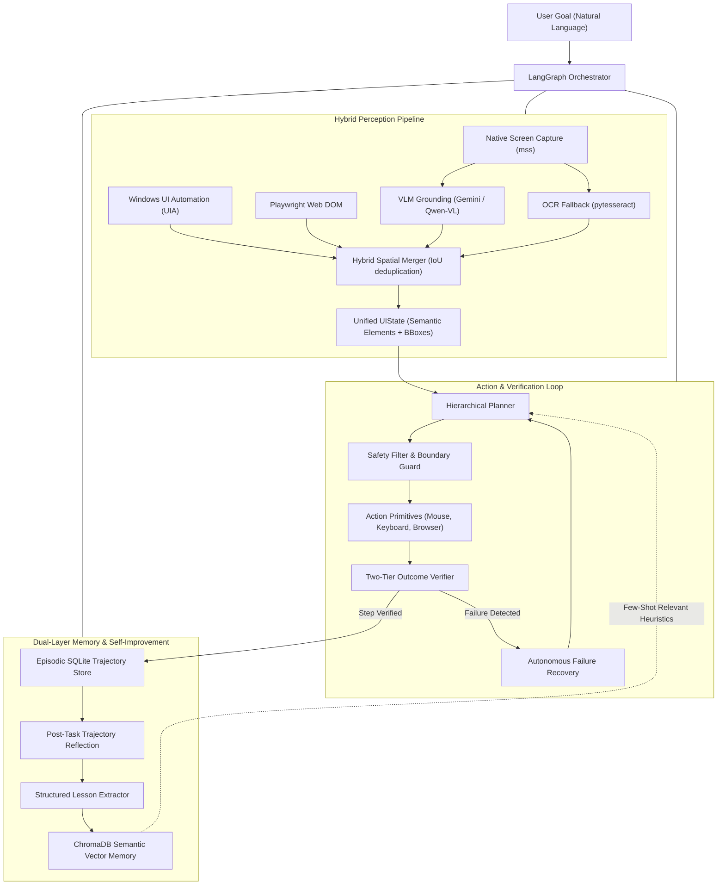

# Comprehensive Engineering Report: Problem Identification & Requirement Analysis
**Project Title:** SIVAC — Self-Improving Vision Agent for Autonomous Computer Use  
**Document Identifier:** SIVAC-ENG-REP-001  
**Version:** 1.0.0  
**Author:** Abhishek Sahu (`abhisheksssss`)  
**Repository:** `abhisheksssss/Self-Improving-Vision-Agent`  
**Status:** Approved for Implementation  
**Date:** September 2026  

---

## Executive Summary

Autonomous Graphical User Interface (GUI) computer-use agents represent the next frontier in artificial intelligence, bridging high-level natural language human intent with complex digital operating environments. However, contemporary vision-based computer control agents (such as Anthropic Computer Use API, OSWorld baselines, and commercial RPA scripts) suffer from critical structural deficiencies: **perception coordinate drift**, **open-loop execution failure loops**, **cross-session amnesia**, **platform fragmentation (Web vs. Desktop)**, and **prohibitive inference token costs**.

This report provides a formal **Problem Identification and Requirement Analysis** for **SIVAC** (*Self-Improving Vision Agent for Autonomous Computer Use*). SIVAC resolves these failure modes by unifying a **hybrid multi-modal perception engine** (VLM visual grounding, local OCR fallback, Playwright browser DOM, and Windows UI Automation), a **closed-loop verification and autonomous recovery state machine** governed via LangGraph, and a **dual-layer self-improvement memory architecture** (SQLite structured trajectory logs and ChromaDB semantic vector store). This document outlines the problem landscape, stakeholder requirements, functional and non-functional specifications, operational constraints, and a full Requirements Traceability Matrix (RTM).

---

## 1. Introduction & Background

### 1.1 Evolution of Computer Automation
Traditional automation has evolved through three distinct eras:
1. **Rule-Based Robotic Process Automation (RPA):** Tools like UiPath, Blue Prism, and AutoIt rely on rigid selectors (XPath, hardcoded window handles, fixed coordinates). While deterministic, they are brittle; a minor UI redesign, font update, or unexpected popup causes total pipeline failure.
2. **Programmatic Web Drivers:** Frameworks like Selenium, Puppeteer, and Playwright provided structured DOM manipulation for web applications, but remain completely isolated from native desktop applications, OS file pickers, and multi-app workflows.
3. **Foundation Model GUI Agents:** Recent advances in Multimodal Large Language Models (MLLMs/VLMs) introduced visual computer control by prompting models with desktop screenshots. While demonstrating impressive zero-shot reasoning, current implementations exhibit severe fragility, high latency, zero memory retention, and open-loop vulnerability.

### 1.2 System Vision: SIVAC
SIVAC is designed as an enterprise-ready, open-source, self-improving computer-use agent. Rather than treating computer use as a simple "prompt $\to$ click" cycle, SIVAC models computer interaction as a **continuous, partially observable Markov decision process (POMDP)** with active verification, failure diagnosis, and cross-session knowledge consolidation.

---

## 2. Problem Identification & In-Depth Root-Cause Analysis

Through empirical benchmarking of modern vision-action models across desktop and web workflows, five fundamental systemic problems have been identified:

### 2.1 Problem 1: Perception Fragility & Coordinate Drift

#### Mechanism of Failure
Standard VLM computer-use agents prompt a model to output coordinate pairs:
$$\text{Action} = \text{click}(x, y) \quad \text{where } x, y \in [0, W] \times [0, H]$$
This paradigm suffers from severe real-world failure modes:
1. **DPI Scaling & Aspect Ratio Distortions:** Modern operating systems (specifically Windows 10 and 11) frequently operate at non-integer DPI scaling (e.g., 125%, 150%, 175%). High-resolution screenshots ($3840 \times 2160$ or $2560 \times 1440$) are downscaled to satisfy VLM token input limits (e.g., $1024 \times 1024$). When the VLM predicts coordinates in its downsampled normalized space and these are scaled back to hardware coordinates, quantization errors accumulate:
   $$\Delta x = |x_{\text{true}} - x_{\text{predicted}}| \ge 15\text{ pixels}$$
   In compact UI layouts (such as Excel toolbars or VS Code status bars), an error of 15 pixels targets the wrong icon or a dead margin.
2. **Textless & Miniature UI Targets:** Modern interfaces feature small glyphs (e.g., maximize/minimize icons, checkboxes, toggle switches, dropdown arrows) without text. Vision models frequently fail to resolve these fine-grained targets without supplementary accessibility handles or local bounding box zooming.
3. **Dynamic Canvas & Non-Standard Renderers:** Native applications built on Flutter, Qt, Canvas, or custom Win32 APIs do not expose standard DOM structures, leaving pure DOM agents blind and pure vision models prone to hallucinating clickable regions.

---

### 2.2 Problem 2: Open-Loop Execution & The Amnesiac Failure Loop

#### Mechanism of Failure
The vast majority of existing GUI automation architectures operate **open-loop**:
$$\text{State } S_t \longrightarrow \text{Action } A_t \longrightarrow \text{Dispatch to OS} \longrightarrow \text{Assume } S_{t+1} \text{ succeeded}$$

In reality, computer operating systems are inherently asynchronous:
* **Network & Render Latency:** When an agent clicks "Submit", the web page or application may take 500 ms to 3 seconds to process the request, display a loading spinner, or navigate.
* **Focus Stealing & Modal Dialogs:** User Account Control (UAC) prompts, cookie consent banners, save dialogs, or unexpected notifications often intercept mouse clicks.
* **The "Death Loop":** When an action fails silently (e.g., clicking on an inactive button), the agent cannot detect the failure. It attempts the next action in its predetermined plan, operating on an invalid mental state. When that fails, it repeatedly re-attempts the exact same failing action, consuming API tokens in an infinite loop until hitting a hard step limit.

---

### 2.3 Problem 3: The Amnesia Problem (Zero Cross-Session Learning)

#### Mechanism of Failure
Current LLM agents possess **ephemeral runtime contexts**. Once a task session ends, all computational experience is discarded.
* **No Experiential Accumulation:** If an agent spends 10 exploratory steps discovering that an internal billing system requires double-clicking a cell before typing, that crucial operational heuristic is lost.
* **Repetitive Failure Overhead:** In subsequent runs of the identical task, the agent incurs the exact same exploratory errors, wasting API quotas, increasing task execution time, and frustrating the end-user.
* **Absence of Semantic Generalization:** Agents fail to generalize specific interface knowledge into reusable rules (e.g., *"When interacting with Chrome file download prompts on Windows, press `Enter` rather than searching for the 'Save' button"*).

---

### 2.4 Problem 4: Platform Silos (Web vs. Desktop Fragmentation)

#### Mechanism of Failure
Existing automation tools are siloed:
* **Web-Only Agents (e.g., Mind2Web, WebVoyager, Browser-Use):** Operate strictly within the Chromium DOM. They cannot interact with local file systems, native desktop software (Excel, ERP clients, terminal emulators, Photoshop), or OS configuration dialogs.
* **Desktop-Only Vision Agents (e.g., OSWorld baselines):** Interact with desktop environments solely through raw screen pixels. When operating inside a web browser, they ignore the deterministic DOM and accessibility tree, leading to slow, error-prone visual clicking on elements that could be targeted with 100% precision via DOM selectors.
* **Enterprise Reality:** Over 80% of enterprise administrative workflows require cross-boundary operations: downloading an export from a web SaaS application, parsing it locally in an office tool, and uploading it to an internal desktop legacy system.

---

### 2.5 Problem 5: Economic Viability, Token Latency & Safety Hazards

#### Mechanism of Failure
1. **The "Token Tax":** Full-resolution image tokens are expensive. Sending a 1080p screenshot to commercial frontier models (e.g., Claude 3.5 Sonnet or GPT-4o) costs approximately 1,600 tokens per image. A 20-step workflow consumes over 32,000 vision tokens for perception alone, costing several dollars per basic task.
2. **Inference Latency:** Multimodal inference takes 2 to 5 seconds per request. A 20-step task requires 60 to 100 seconds of pure LLM waiting time, making interactive automation unacceptably sluggish.
3. **Uncontrolled Operating Hazards:** Giving an AI agent direct control over system mouse and keyboard primitives without defensive guardrails creates extreme operational hazards: accidental permanent file deletion (`Shift+Delete`), transmission of incomplete emails, or execution of destructive terminal commands.

---

## 3. Stakeholder Analysis & User Personas

| Persona | Description | Operational Objectives | Critical Pain Points Addressed |
| :--- | :--- | :--- | :--- |
| **Enterprise Knowledge Worker** | Administrative and operations specialist performing repetitive data entry across multiple apps. | End-to-end task delegation via natural language; reliable execution without code. | Elimination of brittle RPA scripts that break on minor UI layout updates. |
| **QA / Automation Engineer** | Software engineer responsible for end-to-end regression and integration testing. | Autonomous test execution, visual regression verification, detailed failure diagnostics. | Drastically reduced maintenance overhead for test automation suites across desktop and web. |
| **AI Systems Researcher** | Researcher studying multimodal agents, reinforcement learning from computer use, and memory systems. | Transparent benchmarks, trajectory reproducibility, modular architecture for swapping planners and memory models. | Open, fully inspectable LangGraph state machine with structured SQLite and ChromaDB trajectory datasets. |
| **IT & Security Administrator** | System administrator governing workstation security, compliance, and safety. | Zero credential leakage, strict boundary validation, unblockable emergency stop capabilities. | Absolute containment: global emergency kill-switch (`Ctrl+Alt+Esc`), destructive command interceptor, isolated `.env` secrets. |

---

## 4. Comprehensive Requirement Analysis

### 4.1 Functional Requirements (FR)

#### FR-1: Multi-Modal Hybrid Perception Pipeline
* **FR-1.1 High-Performance Desktop Screen Capture:**
  * System shall capture full-screen and active-window screenshots in $\le 150\text{ ms}$ using native OS APIs (`mss`).
  * System shall support multi-monitor setups and dynamic DPI scaling adjustments.
* **FR-1.2 VLM-Driven Visual Element Grounding:**
  * System shall accept screenshots and output bounding boxes `[ymin, xmin, ymax, xmax]` for interactive controls (buttons, inputs, icons, dropdowns) using multimodal models (Gemini 2.5 Flash, Qwen-2-VL).
* **FR-1.3 Local OCR Fallback Engine:**
  * System shall process dense textual regions using local Tesseract OCR (`pytesseract`), extracting pixel bounding boxes and normalized text strings without external API cost.
* **FR-1.4 Native Accessibility & DOM Extraction:**
  * When interacting with native Windows applications, system shall query the Windows UI Automation tree (`pywinauto` / `uiautomation`) to retrieve control types, names, and hardware bounding rectangles.
  * When interacting with web browsers, system shall query the Playwright DOM tree to extract interactive nodes, CSS selectors, and computed bounding boxes.
* **FR-1.5 Spatial Deduplication & Unified UI State Assembly:**
  * System shall merge detections from VLM, OCR, DOM, and UIA using an Intersection-over-Union ($\text{IoU}$) threshold of $\ge 0.50$, eliminating redundant boxes and producing a unified `UIState` with unique, stable element IDs (`element_0`, `element_1`, ...).

---

#### FR-2: Hierarchical Intent Parsing & Action Planning
* **FR-2.1 Natural Language Goal Decomposition:**
  * System shall parse high-level user instructions into discrete sub-goals and sequential action plans.
* **FR-2.2 Context-Conditioned Action Formulation:**
  * At each step $t$, the planner shall formulate the next action conditioned on: (1) high-level goal, (2) current `UIState`, (3) historical action trajectory, and (4) relevant retrieved heuristics from memory.
* **FR-2.3 Abstract Element Targeting:**
  * The planner shall reference semantic element IDs (e.g., `target_id: "element_4"`) rather than absolute pixel coordinates, allowing the execution layer to compute safe centroid coordinates.

---

#### FR-3: Controlled System Action Primitives
* **FR-3.1 Native Desktop Input Primitives:**
  * System shall execute deterministic mouse and keyboard actions via `pyautogui`:
    * `click(target_id | x, y, button="left" | "right")`
    * `double_click(target_id)`
    * `type_text(target_id, text, clear_first=True, press_enter=False)`
    * `hotkey(keys: List[str])` (e.g., `Ctrl+C`, `Alt+Tab`, `Win+R`)
    * `scroll(direction="up" | "down", amount=int)`
    * `wait(seconds=float)`
* **FR-3.2 Native Browser DOM Primitives:**
  * For web targets, system shall provide direct Playwright browser actions (`page.click`, `page.fill`, `page.goto`, `page.evaluate`).
* **FR-3.3 Application Lifecycle Management:**
  * System shall support direct desktop application launching, window focusing, and maximizing via `pywinauto` (`app_open`, `window_focus`).
* **FR-3.4 Coordinate Transformation & DPI Clamping:**
  * System shall compute centroid coordinates $(x_c, y_c) = \left(\frac{x_{\min} + x_{\max}}{2}, \frac{y_{\min} + y_{\max}}{2}\right)$ and scale them by the OS DPI scaling factor before hardware dispatch.

---

#### FR-4: Closed-Loop Outcome Verification
* **FR-4.1 Two-Tier Verification Architecture:**
  * **Tier 1 (Fast Deterministic Check):** Immediately inspect active window title, active URL, focus state, or DOM mutation within $\le 200\text{ ms}$.
  * **Tier 2 (Visual Delta Assessment):** If Tier 1 is inconclusive, capture a post-action screenshot and compare against pre-action visual state using visual difference analysis or a lightweight VLM prompt to verify state transition.
* **FR-4.2 Formal Outcome Classification:**
  * System shall categorize step outcomes into one of five states:
    1. `SUCCESS`: Desired state change confirmed.
    2. `NOOP_NO_CHANGE`: Action dispatched but screen state remained unchanged (e.g., click lagged or hit an inactive zone).
    3. `UNEXPECTED_MODAL`: An unexpected popup, cookie banner, or dialog intercepted the workflow.
    4. `WRONG_NAVIGATION`: Action resulted in an incorrect screen or unexpected window.
    5. `SYSTEM_ERROR`: Application crash, process termination, or missing hardware element.

---

#### FR-5: Autonomous Failure Recovery & Self-Healing
* **FR-5.1 Root-Cause Failure Diagnosis:**
  * When a non-success outcome is verified, system shall invoke a diagnostic reasoning module to isolate the cause of failure.
* **FR-5.2 Adaptive Recovery Actions:**
  * System shall execute autonomous recovery strategies:
    * *Modal Dismissal:* Identify close (`✕`) buttons, `Cancel`, or `Dismiss` controls on unexpected overlays.
    * *Modality Fallback:* If a DOM-based click fails, fall back to UIA or VLM centroid clicking.
    * *Keyboard Fallback:* If mouse focus fails, use `Tab` navigation or keyboard shortcuts (`Enter`, `Esc`, `Ctrl+F`).
    * *Backtracking:* Press `Esc` or navigate back to return to the last known stable state.
* **FR-5.3 Loop Prevention & Retry Caps:**
  * System shall enforce a maximum retry count of 3 attempts per step and an overall task step limit to guarantee termination.

---

#### FR-6: Multi-Level Memory System (Episodic & Semantic)
* **FR-6.1 Structured Trajectory Storage (SQLite):**
  * System shall persist complete execution trajectories in relational SQLite storage, recording: `task_id`, `goal`, `timestamp`, `step_index`, `action_type`, `target_element`, `execution_time_ms`, and `outcome_status`.
* **FR-6.2 Episodic Vector Store (ChromaDB):**
  * System shall store vector embeddings of task goals, screen summaries, and key UI states in ChromaDB.
* **FR-6.3 Semantic Knowledge & Rule Base:**
  * System shall maintain a persistent rule repository of application-specific interaction conventions.
* **FR-6.4 Context-Aware Experience Retrieval:**
  * Prior to task planning, system shall query ChromaDB via cosine similarity search, retrieving top-$K$ ($K=3$) similar historical tasks and injecting their successful strategies and pitfalls into the planner prompt.

---

#### FR-7: Autonomous Self-Improvement & Reflection Engine
* **FR-7.1 Trajectory Evaluation:**
  * Post-task, system shall compute operational metrics: completion success, action economy score, and recovery cycle count.
* **FR-7.2 Failure Reflection & Critique:**
  * For any task involving errors or recoveries, system shall trigger an automated reflection agent to determine:
    * Why did the initial plan fail?
    * What specific environmental cue signaled the failure?
    * What rule would prevent this error in the future?
* **FR-7.3 Structured Lesson Extraction:**
  * System shall formulate extracted insights into machine-actionable heuristics:
    $$\text{Lesson} = \langle \text{App}, \text{ContextPattern}, \text{PrescribedAction}, \text{AvoidAction}, \text{ConfidenceScore} \rangle$$
* **FR-7.4 Dynamic Strategy Prioritization:**
  * System shall continuously update modality preference weights per application (e.g., favoring DOM for web apps and UIA for native Win32 apps).

---

#### FR-8: Real-Time Human-in-the-Loop & Safety Dashboard
* **FR-8.1 Live WebSocket Screen Streaming:**
  * System shall broadcast real-time screenshot frames with bounding box overlays, action feeds, and agent thoughts over FastAPI WebSockets.
* **FR-8.2 Interactive User Supervision:**
  * System shall provide UI controls to pause execution, resume, step-advance, or manually click/type to assist the agent.
* **FR-8.3 Global Emergency Kill Switch:**
  * System shall register an OS-level keyboard hook (`Ctrl+Alt+Esc`) that immediately halts all automation and releases inputs within $\le 50\text{ ms}$.

---

### 4.2 Non-Functional Requirements (NFR)

#### NFR-1: Performance & Latency
* **Screen Capture & Perception Cycle:** $\le 1.2\text{ seconds}$ for full-frame capture and hybrid element extraction.
* **Planning Cycle Latency:** Fast reasoning models (Groq LLaMA-3.3-70b or Gemini 2.5 Flash) shall generate action decisions in $\le 2.0\text{ seconds}$.
* **Action Execution Latency:** Hardware mouse/keyboard primitive dispatch $\le 200\text{ ms}$.
* **Memory Vector Search:** ChromaDB cosine similarity lookup shall execute in $\le 100\text{ ms}$.

#### NFR-2: Safety, Security & Defensive Computing
* **Destructive Action Protection:** System shall intercept high-risk actions (terminal commands containing `rmdir`, `format`, `del /s`, file deletion, password submission, payment processing) and require explicit human approval before execution.
* **Coordinate Clamping:** System shall validate that all target coordinates satisfy $0 \le x \le W$ and $0 \le y \le H$. Any out-of-bounds target must trigger an assertion error rather than erratic mouse leaps.
* **Credential Isolation:** API keys, passwords, and sensitive tokens must be managed via Pydantic Settings and `.env`, and never logged to SQLite or streamed over WebSockets.

#### NFR-3: Cost Efficiency & Model Agnosticism
* **Zero-Cost Operation:** System must be fully operational on free-tier and open-access model endpoints:
  * Google Gemini 2.5 Flash (via free API tier)
  * Groq API (`llama-3.3-70b-versatile` free tier)
  * OpenRouter Free Tier (`qwen/qwen-2-vl-7b-instruct:free`)
  * Local Ollama OpenAI-compatible endpoints
* **Token Optimization:** System shall avoid re-transmitting unchanged full-screen images when accessibility trees (UIA/DOM) confirm the visual state is static.

#### NFR-4: Reliability, Robustness & Fault Tolerance
* **Graceful API Degradation:** If an external VLM API returns HTTP 429 (rate limit) or 5xx errors, system shall apply exponential backoff (initial delay $1\text{s}$, multiplier $2\times$, max 3 retries) and gracefully fall back to local OCR + UIA.
* **Fail-Safe UI Release:** On any unhandled exception or abort, system shall execute `pyautogui.mouseUp()` and release all keyboard keys to prevent stuck keys or drag states.

#### NFR-5: Modularity & Software Architecture Quality
* **Type Safety & Data Contracts:** 100% of data structures (`UIState`, `UIElement`, `BBox`, `Action`, `AgentState`) must use Pydantic v2 schemas.
* **Orchestration Decoupling:** State transitions must be governed via LangGraph state machines, permitting independent swapping of planner models, verification heuristics, or memory engines without altering the execution subsystem.

---

## 5. System Constraints & Operating Assumptions

1. **Host Operating System:** Primary deployment target is **Windows 10 / Windows 11 (64-bit)** due to deep integration with Windows UI Automation (`pywinauto`, `uiautomation`).
2. **Display Setup:** Single primary desktop display or virtual display (recommended: 1920x1080 resolution at 100% or 125% DPI scaling).
3. **Runtime Environment:** Python 3.12+ managed via the `uv` packaging manager.
4. **Third-Party Native Binaries:** Requires local installation of Tesseract OCR (`tesseract.exe`) on the system path and Playwright Chromium binaries (`uv run playwright install chromium`).

---

## 6. Requirements Traceability Matrix (RTM)

The following matrix maps each identified failure mode directly to its addressing requirements, target architectural modules, and automated verification scenarios:

| Problem ID | Failure Mode Description | Requirements | Architectural Module | Verification Scenario |
| :--- | :--- | :--- | :--- | :--- |
| **P-1** | Coordinate drift, pixel hallucination, DPI scaling | **FR-1** (1.1–1.5), **FR-2.3**, **FR-3.4**, **NFR-2** | `src/vision_agent/perception/` (`vlm_detector.py`, `ocr.py`, `ui_automation.py`, `hybrid_merger.py`) | Grounding test on complex multi-window screen; verify $\text{IoU} \ge 0.70$ and centroid accuracy. |
| **P-2** | Open-loop execution, unhandled popups, death loops | **FR-4** (4.1–4.2), **FR-5** (5.1–5.3), **NFR-4** | `src/vision_agent/agent/` (`verifier.py`, `recovery.py`, `graph.py`) | Inject artificial modal dialog over target button; verify agent detects `UNEXPECTED_MODAL` and recovers. |
| **P-3** | Amnesia & lack of cross-session learning | **FR-6** (6.1–6.4), **FR-7** (7.1–7.4) | `src/vision_agent/memory/`, `src/vision_agent/learning/` (`reflection.py`, `lesson_extractor.py`) | Run a task requiring non-standard workaround; verify second run executes with $\ge 30\%$ fewer steps. |
| **P-4** | Desktop vs. Web platform silos | **FR-1.4**, **FR-3.1**, **FR-3.2**, **FR-3.3** | `src/vision_agent/perception/dom.py`, `src/vision_agent/actions/browser.py`, `desktop.py` | Execute workflow downloading file in Chrome and opening it in native Windows Notepad. |
| **P-5** | Prohibitive VLM token costs and latency | **NFR-1**, **NFR-3**, **FR-1.4**, **FR-4.1** | `src/vision_agent/model/` (`factory.py`, `llm.py`), Hierarchical routing | Verify complete task execution using zero-cost Gemini 2.5 Flash free tier and Groq LLaMA-3.3-70b. |
| **P-6** | Uncontrolled safety hazards & lack of stop switch | **FR-8.3**, **NFR-2**, **FR-3.1** | `src/vision_agent/actions/safety.py`, Global Keyboard Hook | Press `Ctrl+Alt+Esc` during active mouse drag; verify immediate halt within $\le 50\text{ ms}$. |

---

## 7. Acceptance Criteria & Test Scenarios

* **AC-01: Multi-Modal Element Grounding**  
  * *Test:* Capture screen containing native Windows controls and web page buttons. Run hybrid merger.  
  * *Pass Criteria:* All interactive elements detected with $\text{IoU} \ge 0.70$; zero duplicate boxes for identical UI elements.
* **AC-02: Two-Tier Closed-Loop Verification**  
  * *Test:* Dispatch a click on a button that opens a dialog. Measure verification speed and accuracy.  
  * *Pass Criteria:* Tier 1 or Tier 2 verification confirms state change in $\le 2.0\text{ seconds}$ and updates `AgentState.last_outcome = "SUCCESS"`.
* **AC-03: Autonomous Recovery Under Failure**  
  * *Test:* Place an unexpected notification banner over the target input field.  
  * *Pass Criteria:* Verifier diagnoses `NOOP` or `UNEXPECTED_MODAL`; recovery module executes modal dismissal or alternate selector; task resumes and succeeds.
* **AC-04: Cross-Session Self-Improvement**  
  * *Test:* Complete a task requiring trial-and-error (e.g., dismissing an obscure overlay). Execute identical task in a fresh session.  
  * *Pass Criteria:* Agent retrieves lesson from ChromaDB; second run completes with $\ge 30\%$ step reduction and zero duplicate exploratory errors.
* **AC-05: Emergency Stop Verification**  
  * *Test:* During rapid typing/clicking, press `Ctrl+Alt+Esc`.  
  * *Pass Criteria:* Automation halts within $\le 50\text{ ms}$; all pressed keys/mouse buttons released; status set to `EMERGENCY_STOP`.

---

## 8. Conclusion & Sign-Off

The **Problem Identification and Requirement Analysis** presented in this report establishes the rigorous engineering foundation for SIVAC. By confronting the root causes of current GUI agent fragility—namely coordinate drift, open-loop execution, platform silos, and amnesia—SIVAC is poised to deliver a resilient, cost-effective, and truly self-improving computer-use agent.

Approved for architectural execution under the phased roadmap detailed in [`implementation_plan.md`](file:///d:/CodeWIthMe/Vision-Agent/implementation_plan.md).

