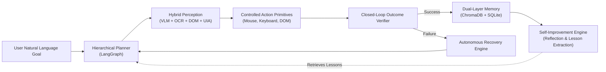
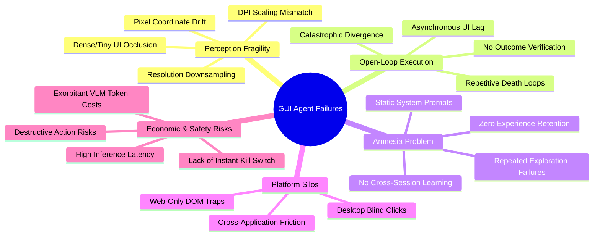
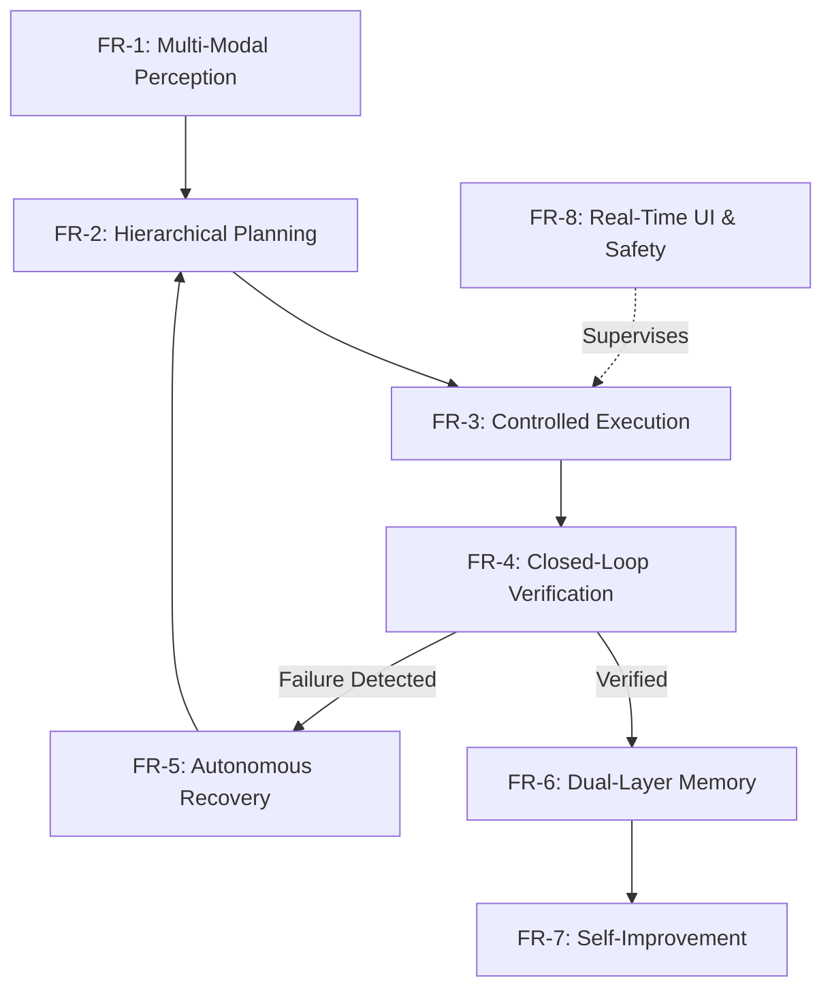

# SIVAC: Problem Identification & Requirement Analysis
**Project:** SIVAC (Self-Improving Vision Agent for Autonomous Computer Use)  
**Author:** Abhishek Sahu (`abhisheksssss`)  
**Status:** Approved Specification  
**Version:** 1.0.0  
**Target Architecture:** Multi-Modal Closed-Loop GUI Agent with Episodic Self-Improvement  

---

## 1. Executive Summary & Context

Modern autonomous computer-use agents aim to bridge the gap between natural language human intent and graphical user interface (GUI) execution. While frontier Large Language Models (LLMs) and Vision-Language Models (VLMs) have demonstrated impressive multimodal reasoning, deploying them as **autonomous, general-purpose computer operators** in complex desktop and web environments remains fragile, costly, and error-prone.

**SIVAC** (*Self-Improving Vision Agent for Autonomous Computer Use*) is engineered to solve the systemic failure modes of current GUI agents. By integrating a **hybrid multi-modal perception pipeline** (VLM + OCR + DOM + Windows UI Automation), a **closed-loop verification-recovery cycle**, and a **dual-layer self-improvement memory system** (Episodic Trajectories + Semantic Heuristic Rules), SIVAC transforms open-loop, amnesiac automation into a resilient, continuously learning system.

---

## 2. Problem Identification (Root-Cause Analysis)

Comprehensive empirical analysis of existing GUI agents (e.g., Anthropic Computer Use, OSWorld benchmarks, open-source browser agents) reveals five foundational problems:

### 2.1 Problem 1: Perception Fragility & Coordinate Drift
- **Pixel/Coordinate Hallucination:** Directly prompting a VLM to output raw screen coordinates `(x, y)` results in high variance and drift. Small misestimations of 10–20 pixels cause missed clicks, unintentional mis-clicks, or activation of adjacent elements.
- **OS Scaling & Resolution Mismatch:** Modern desktop environments use non-integer DPI scaling (125%, 150%, 175%) and multi-monitor setups. When screenshots are captured, downsampled for VLM token efficiency, and mapped back to native hardware coordinates, precision degrades significantly.
- **Visual Occlusion & Small Elements:** Dense application interfaces (e.g., spreadsheets, developer tools, toolbars) contain miniature buttons (16x16 pixels) with icons but no text. Standard vision models frequently fail to resolve these fine-grained targets without specialized local zoom or accessibility trees.

### 2.2 Problem 2: Open-Loop Execution & The "Amnesiac Failure Loop"
- **Lack of Post-Action Verification:** Most existing systems operate *open-loop*: they predict an action, dispatch it to the OS, and blindly assume it succeeded.
- **Asynchronous & Latent UIs:** Real-world applications feature network latency, background processing, animations, and modal popups (UAC dialogs, cookie banners, confirmation prompts). If an agent attempts to type into a field before the page finishes rendering, the action is silently lost.
- **Catastrophic Divergence & Death Loops:** Without outcome verification, an agent cannot detect that an action failed. It continues executing subsequent plan steps against a non-existent state, often falling into infinite "death loops" (repeating the exact same failing action until hard timeout).

### 2.3 Problem 3: The Amnesia Problem (Zero Cross-Session Learning)
- **Zero Experience Retention:** When current agents encounter an idiosyncratic UI behavior (e.g., "In App X, dropdown Y only opens on double-click; clicking outside closes it"), they expend multiple costly exploratory steps to overcome it. However, once the session terminates, that knowledge is discarded.
- **Identical Mistakes:** Next time the agent is asked to perform a similar task on the same application, it starts from zero context and repeats the identical sequence of errors and recovery attempts.

### 2.4 Problem 4: Platform & Modality Silos (Desktop vs. Web Fragmentation)
- **Web-Only vs. Desktop-Only Tools:** Web agents (e.g., Playwright scripts, DOM-based browser extensions) have no access to native OS desktop windows, file dialogs, system settings, or desktop software (Excel, Spotify, IDEs).
- **Desktop Agents Blind to DOM:** Conversely, vision-only desktop agents interacting with a browser treat it as a dumb canvas of pixels, ignoring the rich, deterministic accessibility tree and DOM hierarchy available inside the browser.
- **Cross-App Workflows:** Real-world enterprise tasks inevitably cross boundaries (e.g., downloading an attachment from a web portal, saving it to a local folder, opening it in an Excel macro, and uploading the result to a desktop ERP system).

### 2.5 Problem 5: Economic Viability, Token Latency & Safety Hazards
- **The "Token Tax":** Sending full-resolution desktop images (1080p to 4K) to commercial frontier VLMs on every step costs significant money and rapidly hits API rate limits.
- **Sluggish Interaction:** VLM round-trip latency (2–5 seconds per call) makes fine-grained mouse interactions painfully slow unless combined with local, low-latency OCR and OS accessibility hooks.
- **Uncontrolled Destructive Actions:** An autonomous agent with OS-level mouse and keyboard control presents severe operational hazards (accidental file deletion, sending unintended emails, closing unsaved documents, executing malicious prompt injections from web pages).

---

## 3. Stakeholder & User Persona Analysis

| Persona | Role | Core Needs | Primary Pain Points |
| :--- | :--- | :--- | :--- |
| **Knowledge Worker / Automation Operator** | Automates administrative, cross-application data pipelines | End-to-end task completion, cross-app execution, zero code required | Fragile RPA scripts that break when UI changes; inability to handle unexpected popups |
| **QA / Automation Engineer** | Builds integration & E2E tests for desktop + web software | Resilient test execution, visual regression verification, detailed failure diagnostics | High maintenance cost of brittle CSS/XPath selectors; tests failing due to minor visual updates |
| **Autonomous Agent Researcher** | Evaluates multimodal vision-action models and reinforcement learning | Benchmark metrics, structured trajectory logging, modular architecture | Black-box closed-source implementations; lack of memory and self-improvement benchmarks |
| **System Administrator / SecOps** | Governs desktop security, access controls, and safety | Safe sandboxing, instant kill-switches, audit logs of all keystrokes and clicks | Unchecked agent autonomy, risk of catastrophic data loss, credential leakage |

---

## 4. Comprehensive Requirement Analysis

### 4.1 Functional Requirements (FR)

#### FR-1: Multi-Modal Hybrid Perception & UI State Modeling
- **FR-1.1 High-Speed Screen Capture:** Capture full-desktop and active-window screenshots in $\le 150\text{ ms}$ using native OS APIs (`mss`), supporting multiple monitors and DPI scaling.
- **FR-1.2 VLM-Driven Visual Grounding:** Extract interactive UI elements (buttons, inputs, icons, menus) and output normalized bounding boxes `[ymin, xmin, ymax, xmax]` via multimodal models.
- **FR-1.3 OCR Fallback Engine:** Detect low-contrast, dense, or non-standard text using local OCR (`pytesseract`), extracting pixel bounding boxes and text content.
- **FR-1.4 Native Accessibility & DOM Inspection:**
  - Query Windows UI Automation (`pywinauto` / `uiautomation`) for native desktop control names, handles, and bounding rectangles.
  - Query Playwright DOM for web page accessibility trees, tags, IDs, and positions when interacting with browsers.
- **FR-1.5 Spatial Deduplication & Element Merger:** Unify VLM bounding boxes, OCR spans, and UIA/DOM nodes into a single cohesive `UIState` object using an Intersection-over-Union (IoU) threshold ($\text{IoU} \ge 0.5$) to eliminate duplicate detections while assigning stable semantic IDs.

#### FR-2: Hierarchical Intent Parsing & Action Planning
- **FR-2.1 Goal Decomposition:** Accept free-form natural language goals (e.g., *"Open Google Sheets, import data.csv, and create a bar chart"*) and decompose them into sequential sub-goals.
- **FR-2.2 State-Conditioned Planning:** Generate next actions conditioned on: (1) high-level goal, (2) current `UIState`, (3) historical action trajectory, and (4) relevant retrieved lessons from past sessions.
- **FR-2.3 Abstract Element Targeting:** The planner must reference stable element IDs (e.g., `element_4`) rather than predicting absolute pixel coordinates, leaving coordinate mapping to the deterministic execution layer.

#### FR-3: Controlled Action Primitives & Execution Layer
- **FR-3.1 Native Desktop Primitives:** Provide deterministic system primitives via `pyautogui`:
  - `click(id | bbox | x, y)`, `double_click`, `right_click`
  - `type_text(id | text, clear_first, press_enter)`
  - `hotkey(keys)` (e.g., `Ctrl+C`, `Alt+Tab`, `Win+R`)
  - `scroll(direction, amount)`
  - `wait(seconds)`
- **FR-3.2 Native Browser Primitives:** Provide direct DOM execution via `playwright` for web tasks (direct click, typing, URL navigation, evaluation).
- **FR-3.3 Application Lifecycle Primitives:** Provide direct app launch and window management via `pywinauto` (`app_open`, `window_focus`, `window_maximize`).
- **FR-3.4 Coordinate Transformation:** Automatically map element bounding boxes to safe centroid coordinates, adjusting for OS DPI scaling factors.

#### FR-4: Closed-Loop Verification & Outcome Assessment
- **FR-4.1 Two-Tier Verification:**
  - *Tier 1 (Fast Deterministic Check):* Inspect window title, active URL, focus state, or DOM mutation within 200 ms.
  - *Tier 2 (Visual Delta Assessment):* Capture post-action screenshot and compare against pre-action state using structural similarity or lightweight VLM prompt to verify visual state transition.
- **FR-4.2 Outcome Categorization:** Classify every step outcome into:
  - `SUCCESS`: Expected visual/state transition occurred.
  - `NOOP_NO_CHANGE`: Action executed but screen remained completely unchanged (e.g., clicked inactive area or button lagged).
  - `UNEXPECTED_MODAL`: An unexpected popup, cookie consent, or error dialog appeared.
  - `WRONG_NAVIGATION`: Navigated to an unintended screen or state.
  - `SYSTEM_ERROR`: OS/driver failure or missing target element.

#### FR-5: Autonomous Failure Recovery & Self-Healing
- **FR-5.1 Failure Diagnosis:** In the event of a non-success outcome, automatically invoke a diagnostic reasoning step to isolate the failure cause.
- **FR-5.2 Recovery Strategy Execution:** Implement adaptive recovery procedures:
  - *Popup Dismissal:* Identify and close unexpected overlays or modal dialogs.
  - *Alternative Modality Retry:* If DOM click failed, fall back to UIA or visual centroid click.
  - *Keyboard Fallback:* If mouse click on text field failed to focus, try `Tab` navigation or keyboard shortcuts (`Ctrl+F`, `Alt+Enter`).
  - *Backtracking:* Press `Esc` or click browser back button to return to last stable state.
- **FR-5.3 Retry & Loop Prevention:** Enforce a maximum retry budget per step ($N=3$) and total step limit to prevent infinite loops.

#### FR-6: Multi-Level Memory System (Episodic & Semantic)
- **FR-6.1 Structured Trajectory Storage (SQLite):** Persist every task run, including task ID, timestamp, goal, full action sequence, step execution latencies, and outcome labels.
- **FR-6.2 Episodic Vector Store (ChromaDB):** Embed and index task goals, screen descriptions, and key visual states using vector embeddings to enable semantic similarity retrieval.
- **FR-6.3 Semantic Knowledge & Rule Store:** Store verified interaction rules (e.g., *"Application 'Notepad' requires 'Ctrl+S' followed by waiting 500ms before typing filename"*).
- **FR-6.4 Context-Aware Retrieval:** At the start of a task, retrieve the top-$K$ most similar past trajectories and associated rules, injecting them into the planner's few-shot prompt context.

#### FR-7: Self-Improvement & Continuous Learning Engine
- **FR-7.1 Trajectory Evaluation:** Compute quantitative task metrics post-completion (success status, total steps, execution time, number of recovery cycles).
- **FR-7.2 Failure Reflection:** For failed or recovered tasks, run an automated reflection prompt identifying:
  - What was the root error?
  - What heuristic or rule would have avoided this error?
- **FR-7.3 Structured Lesson Extraction:** Convert reflection into explicit machine-readable rules:
  $$\text{Rule} := \langle \text{Condition: } (\text{App}, \text{UIContext}), \text{Action: } (\text{Strategy}, \text{Avoidance}), \text{Confidence} \rangle$$
- **FR-7.4 Strategy Prioritization Matrix:** Update modality preference weights based on empirical success rates per application (e.g., favoring DOM for web apps and UIA for native Win32 apps).

#### FR-8: Real-Time Human-in-the-Loop & Dashboard Interface
- **FR-8.1 WebSocket Live Streaming:** Broadcast live screenshot frames with detected bounding box overlays, current agent thought, and action logs via FastAPI WebSockets.
- **FR-8.2 Interactive Oversight:** Provide human intervention controls (Pause Agent, Resume, Single-Step Advance, Manual Coordinate Override).
- **FR-8.3 Global Emergency Kill Switch:** Register an unblockable OS-level keyboard hook (`Ctrl+Alt+Esc`) that immediately halts mouse/keyboard automation within $\le 50\text{ ms}$.

---

### 4.2 Non-Functional Requirements (NFR)

#### NFR-1: Performance & Latency
- **Perception Latency:** Full screen capture + local OCR/UIA extraction $\le 1.2\text{ seconds}$.
- **Planning Cycle Latency:** Fast reasoning models (Groq LLaMA-3.3-70b or Gemini 2.5 Flash) must return next action decisions in $\le 2.0\text{ seconds}$.
- **End-to-End Step Time:** Complete cycle (Observe $\to$ Plan $\to$ Act $\to$ Verify) $\le 3.5\text{ seconds}$ for standard steps.
- **Memory Retrieval:** Vector similarity search in ChromaDB $\le 100\text{ ms}$.

#### NFR-2: Safety, Security & Guardrails
- **Destructive Action Protection:** Define a blacklist of dangerous commands/actions (`format`, `del /s`, `rmdir`, emptying trash, sending emails, processing payments). Such actions must pause execution and trigger a high-priority user confirmation dialog.
- **Coordinate Boundary Validation:** The execution layer must strictly validate that all click coordinates satisfy $0 \le x \le W$ and $0 \le y \le H$. Any out-of-bounds target must trigger an immediate assertion error rather than erratic mouse leaps.
- **Credential & Secret Protection:** No API keys or credentials may be logged to the trajectory database or emitted over WebSockets. Environment variables must be parsed via Pydantic Settings and stored securely in `.env`.

#### NFR-3: Cost Efficiency & Multi-Model Tiering
- **Zero-Cost Base Operation:** The agent must be fully functional using free-tier / open-access providers:
  - *Perception/Vision:* Google Gemini 2.5 Flash (via free API tier) and OpenRouter Qwen-2-VL-7B.
  - *Reasoning/Planning:* Groq LLaMA-3.3-70b-versatile and Gemini 2.5 Flash.
- **Token Economy:** The agent must avoid re-sending unchanged full-screen images when accessibility tree (UIA/DOM) updates provide sufficient semantic state.

#### NFR-4: Reliability, Robustness & Fault Tolerance
- **Graceful Network Degradation:** If external VLM APIs fail or encounter HTTP 429 (rate limit), the agent must apply exponential backoff (initial delay $1\text{s}$, multiplier $2\times$, max 3 retries) and gracefully fall back to OCR + UIA where applicable.
- **Fail-Safe UI Release:** In any exception or unexpected exit, mouse buttons and keyboard keys must be immediately released (`pyautogui.mouseUp()`, `keyUp()`) to prevent stuck keys or phantom drag states.

#### NFR-5: Modularity & Extensibility
- **Strict Data Contracts:** All inter-module communication must use Pydantic v2 schemas (`UIState`, `UIElement`, `BBox`, `Action`, `AgentState`).
- **Orchestration Decoupling:** State transitions must be governed via LangGraph state machines, permitting independent swapping of planner models, verification heuristics, or memory engines without altering the execution subsystem.

---

## 5. System Constraints & Assumptions

1. **Host Operating System:** Primary deployment target is **Windows 10 / Windows 11 (x64)** due to native Windows UI Automation (`pywinauto`, `uiautomation`).
2. **Display Configuration:** Single primary monitor or defined virtual display resolution (recommended: 1920x1080 at 100% or 125% DPI scaling).
3. **Runtime Environment:** Python 3.12+ managed strictly through the `uv` packaging system.
4. **Third-Party Dependencies:** Local installation of Tesseract OCR for dense text extraction fallback, and Playwright Chromium binaries for browser inspection.

---

## 6. Requirements Traceability Matrix

This matrix maps each identified problem directly to its functional/non-functional requirements and the corresponding implementation component in the SIVAC architecture:

| Problem ID | Identified Problem Description | Addressed by Requirements | Target Architecture Component |
| :--- | :--- | :--- | :--- |
| **P-1** | Coordinate drift, pixel hallucination, DPI scaling errors | **FR-1** (FR-1.1 – FR-1.5), **FR-2.3**, **FR-3.4**, **NFR-2** | `src/vision_agent/perception/` (`vlm_detector.py`, `ocr.py`, `ui_automation.py`, `hybrid_merger.py`) |
| **P-2** | Open-loop execution, repetitive failure loops, unhandled popups | **FR-4** (FR-4.1, FR-4.2), **FR-5** (FR-5.1 – FR-5.3), **NFR-4** | `src/vision_agent/agent/` (`verifier.py`, `recovery.py`, `graph.py`) |
| **P-3** | Amnesia, zero cross-session retention of lessons | **FR-6** (FR-6.1 – FR-6.4), **FR-7** (FR-7.1 – FR-7.4) | `src/vision_agent/memory/`, `src/vision_agent/learning/` (`reflection.py`, `lesson_extractor.py`, `strategy.py`) |
| **P-4** | Fragmentation between web DOM and native desktop UI | **FR-1.4**, **FR-3.1**, **FR-3.2**, **FR-3.3** | `src/vision_agent/perception/dom.py`, `src/vision_agent/actions/browser.py`, `desktop.py` |
| **P-5** | High VLM token cost and sluggish latency | **NFR-1**, **NFR-3**, **FR-1.4**, **FR-4.1** | `src/vision_agent/model/` (`factory.py`, `llm.py`), Hierarchical routing |
| **P-6** | Safety hazards, accidental file corruption, lack of stop switch | **FR-8.3**, **NFR-2**, **FR-3.1** | `src/vision_agent/actions/safety.py`, Global Keyboard Hook (`Ctrl+Alt+Esc`) |

---

## 7. Acceptance Criteria & Verification Scenarios

| Scenario ID | Test Workflow | Expected Operational Outcome | Acceptance Standard |
| :--- | :--- | :--- | :--- |
| **AC-01** | Multi-modal Element Grounding | Given an active desktop window with both buttons and text, detect elements via hybrid merger. | IoU $\ge 0.70$ on interactive targets; zero duplicate overlapping bounding boxes. |
| **AC-02** | Closed-Loop Verification | Agent clicks a button that opens a dialog. Verifier checks screen delta. | Verifier correctly identifies `SUCCESS` within $\le 2\text{s}$; updates internal `AgentState`. |
| **AC-03** | Failure Recovery Injection | Simulate a missing element or blocked button (modal dialog placed in front). | Agent detects `NOOP` or `UNEXPECTED_MODAL`, triggers recovery, dismisses modal, and resumes task. |
| **AC-04** | Self-Improvement Retention | Agent completes a novel task requiring a non-trivial workaround. Run task a second time. | Second run executes in $\ge 30\%$ fewer steps by retrieving learned lesson from ChromaDB. |
| **AC-05** | Emergency Stop Latency | While agent is typing/moving mouse, user presses `Ctrl+Alt+Esc`. | Action halts immediately ($\le 50\text{ms}$), releases all inputs, logs safety abort to SQLite. |

