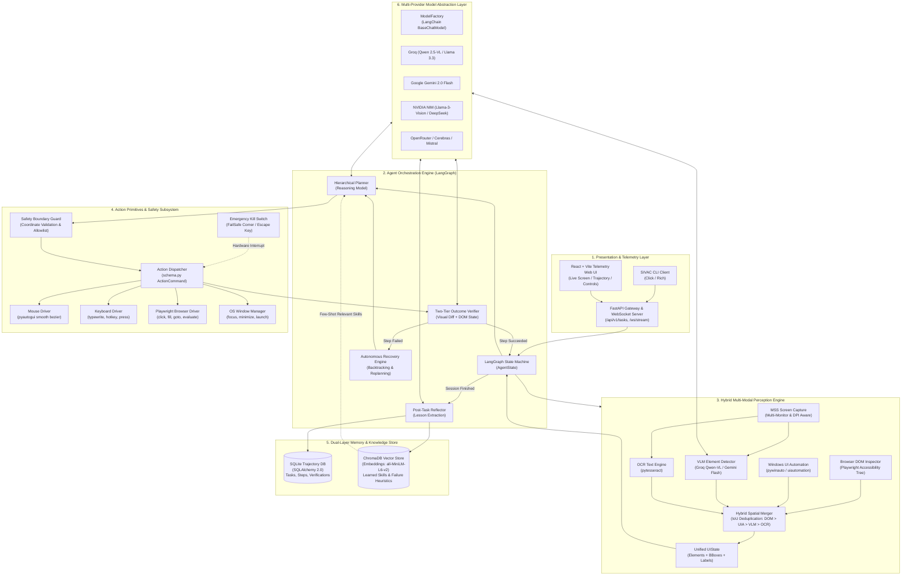
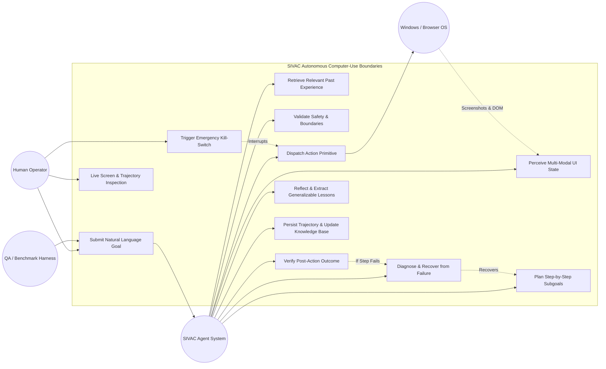
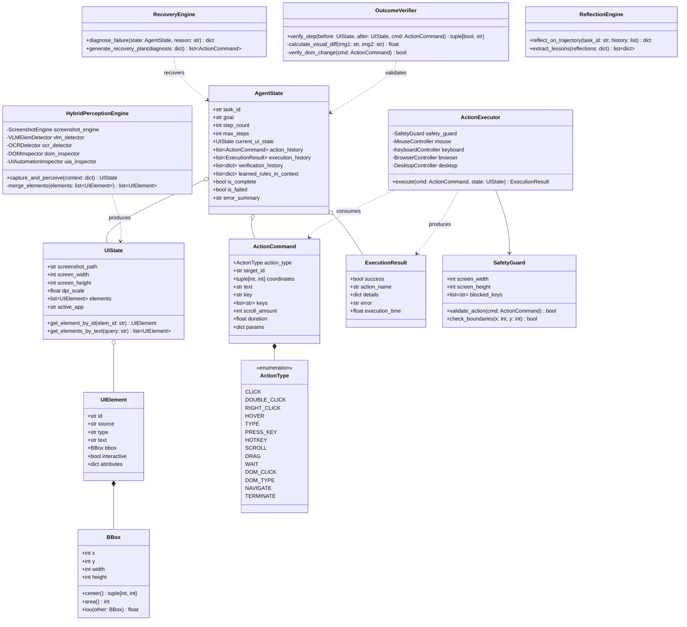
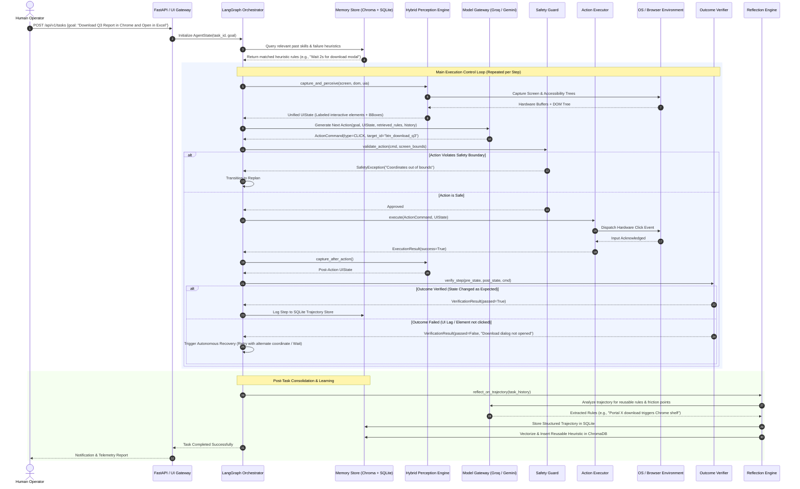
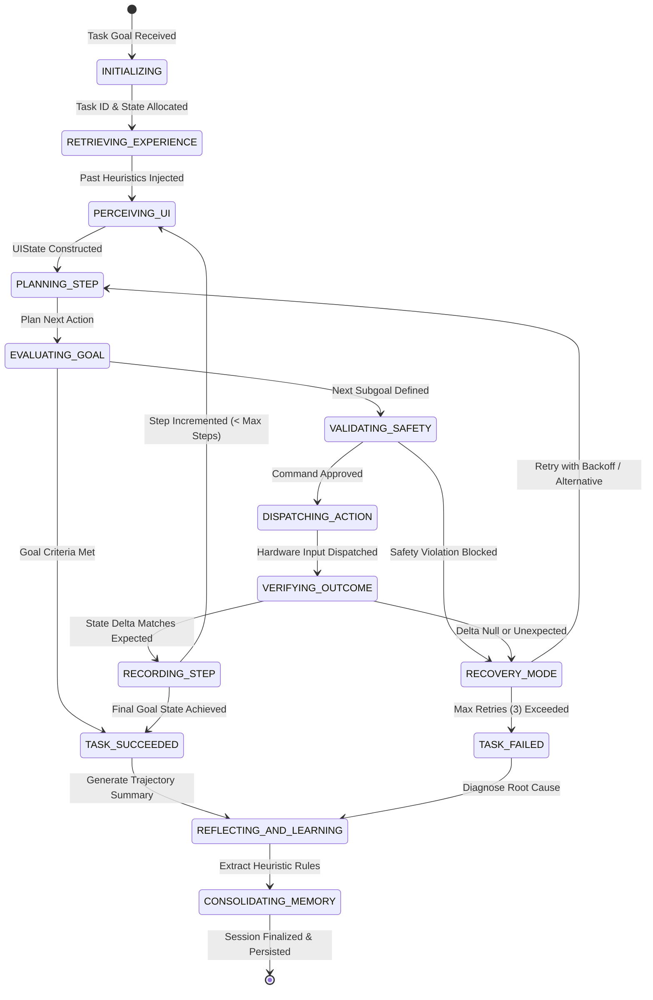
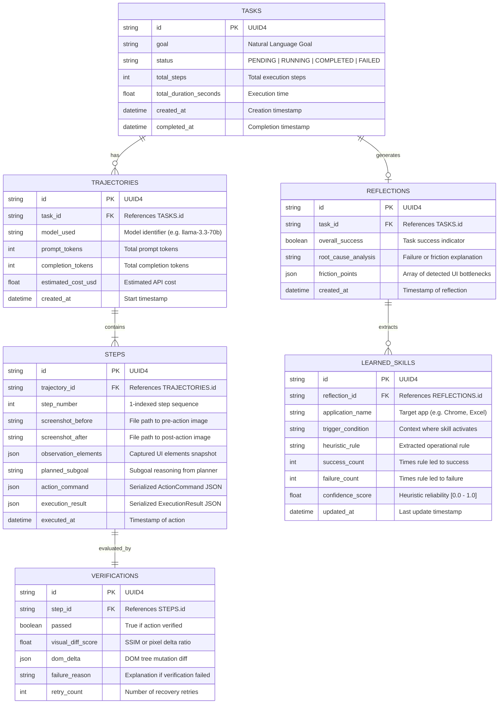
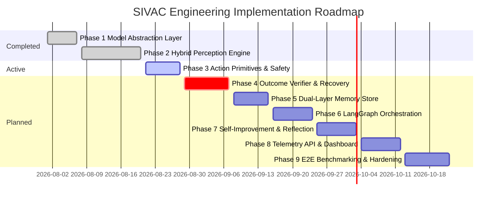

# SIVAC: System Design & Planning Specification
**Project Title:** SIVAC — Self-Improving Vision Agent for Autonomous Computer Use  
**Document Identifier:** SIVAC-ENG-DES-002  
**Version:** 1.0.0  
**Author:** Abhishek Sahu (`abhisheksssss`)  
**Status:** Approved for Implementation  
**Date:** September 2026  

---

## 1. Executive Summary & Architectural Mission

Modern autonomous computer-use agents must reliably bridge human natural language objectives with graphical user interface (GUI) environments across both desktop operating systems and web browsers. Existing open-loop, vision-only agents suffer from four systemic vulnerabilities: **perception coordinate drift**, **amnesiac execution** (inability to learn from previous mistakes), **open-loop failure propagation** (blind execution without outcome verification), and **prohibitive VLM inference costs**.

**SIVAC** (*Self-Improving Vision Agent for Autonomous Computer Use*) resolves these challenges through a deterministic, closed-loop, and self-improving architecture. Rather than relying on simple end-to-end prompt-and-click loops, SIVAC implements an 8-stage cybernetic control loop:

$$\text{Observe} \longrightarrow \text{Perceive} \longrightarrow \text{Retrieve} \longrightarrow \text{Plan} \longrightarrow \text{Act} \longrightarrow \text{Verify} \longrightarrow \text{Diagnose/Recover} \longrightarrow \text{Reflect/Learn}$$

### Core Design Objectives
1. **Hybrid Deterministic Perception:** Fuse fast local perception (Tesseract OCR, Windows UI Automation, Playwright Web DOM) with multimodal Vision-Language Models (VLMs) using spatial Intersection-over-Union (IoU) deduplication to eliminate coordinate hallucination.
2. **Deterministic Closed-Loop Verification:** Every dispatched mouse or keyboard primitive is actively verified via visual diffing (SSIM / perceptual hash) and DOM state delta before proceeding to the next step.
3. **Dual-Layer Memory & Self-Improvement:** Maintain an episodic trajectory database (SQLite) for granular operational telemetry and a semantic vector memory (ChromaDB) that abstracts failure patterns into reusable heuristic rules.
4. **Guaranteed Zero-Cost Tier Viability:** Architected to run on high-performance free-tier API endpoints (Groq Llama 3 / Qwen-VL, Google Gemini 2.0 Flash, NVIDIA NIM, Cerebras) without compromising enterprise capability.
5. **Absolute Safety Guardrails:** Strict allowlisted JSON action schemas, screen boundary validation, and an immediate hardware/software emergency stop (Kill Switch) preventing unintended or destructive operations.

---

## 2. System Architecture

### 2.1 High-Level Architecture Diagram



### 2.2 Subsystem Decomposition

| Subsystem | Responsibilities | Key Technologies |
| :--- | :--- | :--- |
| **Presentation & Telemetry** | Provides real-time operator control, task input, visual overlay rendering, trajectory inspection, and instant emergency stop. | FastAPI, WebSockets, React, Vite, Lucide Icons, Vanilla CSS |
| **Orchestration (LangGraph)** | Governs the finite state machine of the agent, maintaining episodic state, managing transitions, and coordinating error recovery. | LangGraph, Pydantic v2, Python 3.12 |
| **Model Abstraction** | Unified multi-provider interface with automated fallback, rate-limit retries, and zero-cost endpoint routing. | LangChain Core, `ChatGoogleGenerativeAI`, `ChatGroq`, `ChatNVIDIA`, `ChatOpenAI` |
| **Hybrid Perception** | Captures multi-monitor high-DPI screenshots, extracts structured accessibility trees, runs OCR, detects visual affordances, and merges overlapping bboxes. | `mss`, Pillow, `pytesseract`, Playwright, `pywinauto`, `uiautomation` |
| **Action & Safety** | Validates structured action commands against screen geometry and security rules; dispatches mouse/keyboard/DOM events safely. | PyAutoGUI, Playwright, pywinauto, Pydantic |
| **Outcome Verifier** | Verifies execution outcomes through structural DOM comparison, OCR text assertion, and perceptual visual diffs. | Pillow, OpenCV/SSIM, DOM delta |
| **Dual-Layer Memory** | Stores exact step-by-step audit logs in SQLite and vectorizes failure reflections and operational heuristics in ChromaDB. | SQLAlchemy 2.0, SQLite, ChromaDB, Sentence-Transformers |

---

## 3. UML Diagrams

### 3.1 Use Case Diagram



### 3.2 Class Diagram



### 3.3 Sequence Diagram: End-to-End Closed-Loop Execution



### 3.4 State Machine Diagram (LangGraph Workflow)



---

## 4. Database & Storage Architecture

SIVAC employs a **dual-layer storage architecture**:
1. **Relational Database (SQLite / SQLAlchemy 2.0):** Guarantees strict transactional integrity, foreign-key relationships, and indexing for detailed audit logging of tasks, trajectory steps, raw actions, and visual verification results.
2. **Vector Database (ChromaDB):** Embeds high-level task goals, UI contexts, and post-task failure lessons into dense vector collections for fast semantic retrieval during the planning phase of future sessions.

### 4.1 Relational Entity-Relationship (ER) Diagram



### 4.2 SQL DDL Schema Specification

```sql
-- SIVAC Relational Schema (SQLite 3 compatible)

CREATE TABLE IF NOT EXISTS tasks (
    id TEXT PRIMARY KEY NOT NULL,
    goal TEXT NOT NULL,
    status TEXT NOT NULL CHECK(status IN ('PENDING', 'RUNNING', 'COMPLETED', 'FAILED', 'CANCELLED')),
    total_steps INTEGER NOT NULL DEFAULT 0,
    total_duration_seconds REAL NOT NULL DEFAULT 0.0,
    created_at TIMESTAMP NOT NULL DEFAULT CURRENT_TIMESTAMP,
    completed_at TIMESTAMP
);

CREATE TABLE IF NOT EXISTS trajectories (
    id TEXT PRIMARY KEY NOT NULL,
    task_id TEXT NOT NULL,
    model_used TEXT NOT NULL,
    prompt_tokens INTEGER NOT NULL DEFAULT 0,
    completion_tokens INTEGER NOT NULL DEFAULT 0,
    estimated_cost_usd REAL NOT NULL DEFAULT 0.0,
    created_at TIMESTAMP NOT NULL DEFAULT CURRENT_TIMESTAMP,
    FOREIGN KEY (task_id) REFERENCES tasks(id) ON DELETE CASCADE
);

CREATE TABLE IF NOT EXISTS steps (
    id TEXT PRIMARY KEY NOT NULL,
    trajectory_id TEXT NOT NULL,
    step_number INTEGER NOT NULL,
    screenshot_before TEXT NOT NULL,
    screenshot_after TEXT,
    observation_elements TEXT, -- JSON blob of UI elements
    planned_subgoal TEXT NOT NULL,
    action_command TEXT NOT NULL, -- JSON blob of ActionCommand
    execution_result TEXT NOT NULL, -- JSON blob of ExecutionResult
    executed_at TIMESTAMP NOT NULL DEFAULT CURRENT_TIMESTAMP,
    FOREIGN KEY (trajectory_id) REFERENCES trajectories(id) ON DELETE CASCADE,
    UNIQUE(trajectory_id, step_number)
);

CREATE TABLE IF NOT EXISTS verifications (
    id TEXT PRIMARY KEY NOT NULL,
    step_id TEXT NOT NULL UNIQUE,
    passed INTEGER NOT NULL CHECK(passed IN (0, 1)),
    visual_diff_score REAL NOT NULL DEFAULT 0.0,
    dom_delta TEXT, -- JSON blob
    failure_reason TEXT,
    retry_count INTEGER NOT NULL DEFAULT 0,
    FOREIGN KEY (step_id) REFERENCES steps(id) ON DELETE CASCADE
);

CREATE TABLE IF NOT EXISTS reflections (
    id TEXT PRIMARY KEY NOT NULL,
    task_id TEXT NOT NULL UNIQUE,
    overall_success INTEGER NOT NULL CHECK(overall_success IN (0, 1)),
    root_cause_analysis TEXT NOT NULL,
    friction_points TEXT, -- JSON array
    created_at TIMESTAMP NOT NULL DEFAULT CURRENT_TIMESTAMP,
    FOREIGN KEY (task_id) REFERENCES tasks(id) ON DELETE CASCADE
);

CREATE TABLE IF NOT EXISTS learned_skills (
    id TEXT PRIMARY KEY NOT NULL,
    reflection_id TEXT,
    application_name TEXT NOT NULL,
    trigger_condition TEXT NOT NULL,
    heuristic_rule TEXT NOT NULL,
    success_count INTEGER NOT NULL DEFAULT 1,
    failure_count INTEGER NOT NULL DEFAULT 0,
    confidence_score REAL NOT NULL DEFAULT 0.8,
    created_at TIMESTAMP NOT NULL DEFAULT CURRENT_TIMESTAMP,
    updated_at TIMESTAMP NOT NULL DEFAULT CURRENT_TIMESTAMP,
    FOREIGN KEY (reflection_id) REFERENCES reflections(id) ON DELETE SET NULL
);

-- Performance Indexes
CREATE INDEX IF NOT EXISTS idx_tasks_status ON tasks(status);
CREATE INDEX IF NOT EXISTS idx_steps_trajectory ON steps(trajectory_id, step_number);
CREATE INDEX IF NOT EXISTS idx_skills_app ON learned_skills(application_name);
```

### 4.3 Vector Database Schema (ChromaDB Collections)

ChromaDB is utilized as a local, zero-infrastructure vector store embedded directly in the agent runtime. It maintains two specialized collections:

#### Collection 1: `episodic_trajectories`
* **Purpose:** Enables few-shot retrieval of past task demonstrations given a new natural language user objective.
* **Document Text:** Concatenation of `goal` and `initial_active_app` (e.g., `"Goal: Download invoice PDF in Google Chrome. App: Chrome"`).
* **Metadata Schema:**
  ```json
  {
    "task_id": "str (UUID4)",
    "status": "COMPLETED | FAILED",
    "total_steps": "int",
    "duration_seconds": "float",
    "model_used": "str",
    "timestamp": "float"
  }
  ```
* **Distance Metric:** Cosine Similarity (`hnsw:space: cosine`).

#### Collection 2: `learned_heuristics`
* **Purpose:** Dynamic retrieval of application-specific interaction rules injected directly into the Hierarchical Planner's context.
* **Document Text:** `trigger_condition` + `" | Application: "` + `application_name` (e.g., `"Trigger: File download modal in Chrome | Rule: Wait 2.5s for file shelf animation to finish before clicking"`).
* **Metadata Schema:**
  ```json
  {
    "skill_id": "str (UUID4)",
    "application_name": "str",
    "confidence_score": "float",
    "success_count": "int",
    "failure_count": "int"
  }
  ```
* **Embedding Model:** Local default `all-MiniLM-L6-v2` (running locally via ONNX without API token usage) or optional `text-embedding-004`.

---

## 5. Technology Stack Selection & Tradeoff Analysis

| Layer | Selected Technology | Alternative Considered | Technical Tradeoff & Rationale |
| :--- | :--- | :--- | :--- |
| **Language & Runtime** | **Python 3.12** | Python 3.10 / Node.js / Rust | Python is the uncontested standard for AI/VLM orchestration, LangChain/LangGraph, and OS automation bindings (`pywinauto`, `pyautogui`). Python 3.12 provides substantial runtime speedups and native typing features. |
| **Package Management** | **`uv` + `hatchling`** | Poetry / Pipenv / conda | `uv` is 10-100x faster than pip/poetry, handles cross-platform lockfiles cleanly (`uv.lock`), and integrates directly with modern PEP 621 `pyproject.toml`. |
| **Orchestration Engine** | **LangGraph** | AutoGen / CrewAI / Raw While-Loops | LangGraph models the agent as a cyclic, deterministic Directed Acyclic Graph (DAG) with explicit checkpointing, state rollbacks, and recovery branches. AutoGen/CrewAI lack fine-grained deterministic step verification. |
| **Model Abstraction** | **LangChain BaseChatModel** | Raw REST / LiteLLM | Provides standardized multi-modal message formats across OpenAI, Google GenAI, Groq, and NVIDIA NIM with unified streaming and tool-calling interfaces. |
| **Vision-Language Model** | **Groq Qwen 2.5-VL / Gemini 2.0 Flash** | GPT-4o / Claude 3.5 Sonnet | Groq and Google AI Studio provide high-throughput free-tier inference (sub-500ms TTFT), allowing cost-effective high-frequency visual ground loops that would cost $50+/hr on commercial proprietary models. |
| **Screen Perception** | **`mss` + PIL + `pytesseract`** | OpenCV raw / PyGetWindow | `mss` captures native multi-monitor screen buffers in <15ms without OS overhead. Local `pytesseract` provides zero-cost, instant text detection fallback when cloud VLMs downsample tiny fonts. |
| **Accessibility & DOM** | **Playwright + `pywinauto`** | Selenium / WinAppDriver | Playwright provides deep, headless/headful CDP DOM access with native element coordinate mapping. `pywinauto` gives native Windows accessibility trees without requiring heavy server daemons. |
| **Action Automation** | **`pyautogui` + OS Virtual Inputs** | Native C Win32 `SendInput` | PyAutoGUI provides cross-platform mouse/keyboard automation with built-in fail-safes (moving cursor to corner triggers `FailSafeException`). |
| **Relational Storage** | **SQLite + SQLAlchemy 2.0** | PostgreSQL / MySQL | Zero configuration, file-based portability, fully ACID compliant, and zero operational overhead for desktop users. Can be swapped for PostgreSQL in enterprise multi-agent deployments. |
| **Vector Storage** | **ChromaDB (Embedded)** | Pinecone / Weaviate / Milvus | Pure Python embedded vector store running in-process; requires no external Docker container or hosted cloud service, maintaining zero setup friction. |
| **API & Web Server** | **FastAPI + Uvicorn** | Flask / Django | Asynchronous native support for high-throughput WebSockets (streaming live desktop frames and real-time execution logs) with automatic OpenAPI documentation. |
| **Web Dashboard UI** | **React + Vite + Modern CSS** | Streamlit / Gradio | Streamlit and Gradio re-render entire components upon state change, causing unmanageable visual flickering during live 30fps screen streaming. React provides fluid, low-latency UI updates. |

---

## 6. Project Plan & Implementation Timeline

The project follows a rigorous 9-phase progressive engineering roadmap. Each phase delivers fully tested, decoupled modules before proceeding to high-level orchestration.

### 6.1 Phase Breakdown & Status Matrix



### 6.2 Detailed Phase Deliverables

#### Phase 1: Model Abstraction Layer [COMPLETED ✅]
* **Deliverables:**
  * Pydantic configuration settings (`src/vision_agent/config.py`) loading multi-provider keys (`GEMINI`, `GROQ`, `NVIDIA`, `OPENROUTER`).
  * Unified `ModelFactory` (`src/vision_agent/model/`) wrapping LangChain chat models with automated fallback.
  * Integration test suite (`test_models.py`) validating model reasoning and VLM capabilities.

#### Phase 2: Hybrid Multi-Modal Perception Engine [COMPLETED ✅]
* **Deliverables:**
  * `state.py`: Domain models for `BBox`, `UIElement`, and `UIState`.
  * `screenshot.py`: Multi-monitor, DPI-aware capture engine via `mss` and PIL.
  * `vlm_detector.py`: Visual grounding parser prompting VLMs to return bounding boxes.
  * `ocr.py`: Local `pytesseract` OCR text locator.
  * `dom.py` & `ui_automation.py`: Playwright DOM inspector and Windows UI Automation tree traversal.
  * `hybrid_merger.py`: Spatial deduplication engine with IoU hierarchy (`DOM > UIA > VLM > OCR`).
  * Test suite (`test_perception.py`) verifying element detection and spatial merging.

#### Phase 3: Action Primitive Layer & Safety Subsystem [UNDERWAY 🔄]
* **Deliverables:**
  * `schema.py`: Strict Pydantic action definitions (`ActionType`, `ActionCommand`, `ExecutionResult`).
  * `safety.py`: Screen boundary checks, forbidden hotkey blocking, and emergency corner failsafe.
  * `mouse.py` & `keyboard.py`: Human-like smooth Bézier mouse movement and typed keystrokes.
  * `browser.py` & `desktop.py`: Playwright DOM element actions and OS window management.
  * `executor.py`: Unified dispatcher resolving element IDs to physical screen coordinates.
  * Verification suite (`test_actions.py`) validating mouse clicks, typing, and safety aborts.

#### Phase 4: Outcome Verifier & Closed-Loop Recovery Engine [UPCOMING]
* **Deliverables:**
  * Two-tier verifier combining visual pixel/SSIM delta and DOM mutation tracking.
  * Heuristic failure classifier distinguishing UI lag from missing elements or unclickable layers.
  * Backtracking recovery engine implementing retry with exponential backoff and alternate strategies.

#### Phase 5: Dual-Layer Memory & Trajectory Storage [UPCOMING]
* **Deliverables:**
  * SQLAlchemy 2.0 SQLite schema (`tasks`, `trajectories`, `steps`, `verifications`, `reflections`).
  * ChromaDB vector collections for task trajectories and learned application heuristics.
  * High-speed semantic similarity retrieval pipeline for planning prompts.

#### Phase 6: Agent Orchestration Engine (LangGraph) [UPCOMING]
* **Deliverables:**
  * LangGraph cyclic state machine managing `AgentState`.
  * Hierarchical planner node decomposing high-level tasks into discrete subgoals.
  * Integrated safety check, execution, verification, and recovery nodes.

#### Phase 7: Self-Improvement & Reflection Engine [UPCOMING]
* **Deliverables:**
  * Post-task trajectory analyzer identifying friction points and recurring errors.
  * Heuristic lesson extraction module synthesizing natural language rules into structured skill objects.
  * Dynamic rule confidence updater adjusting weights based on subsequent task success.

#### Phase 8: Telemetry, API Gateway & Web Dashboard [UPCOMING]
* **Deliverables:**
  * FastAPI REST API (`/api/v1/tasks`, `/api/v1/trajectories`, `/api/v1/skills`).
  * Low-latency WebSocket streaming live screen captures with annotated element bounding boxes.
  * Modern React + Vite web dashboard featuring live stream, manual override, and audit playback.

#### Phase 9: End-to-End Evaluation & Benchmark Hardening [UPCOMING]
* **Deliverables:**
  * Benchmark test harness evaluating success rate against standard computer-use suites (OSWorld, WebArena).
  * Robustness stress testing under UI lag, modal interruptions, and multi-monitor setups.
  * Final production packaging via Hatchling wheels and `sivac` CLI entry point.

---

## 7. Risk Analysis & Mitigation Strategies

| Risk Factor | Severity | Probability | Impact Description | Architectural Mitigation Strategy |
| :--- | :--- | :--- | :--- | :--- |
| **VLM Coordinate Drift** | High | High | VLM hallucinates click coordinates by 20-50px, clicking empty space. | **Hybrid Spatial Merger:** Prioritize exact DOM and Windows UI Automation coordinates over VLM estimates. Use VLM only for semantic grounding. |
| **Asynchronous UI Latency** | High | High | Agent clicks an element before page rendering finishes, causing action loss. | **Post-Action Verifier:** Enforce mandatory wait-and-verify loops with configurable timeout (up to 3s) before declaring step completion. |
| **Infinite Failure Death Loops** | Critical | Med | Agent gets stuck repeating the same failing action indefinitely. | **Recovery Circuit Breaker:** Track step action signatures. If identical action fails twice, trigger autonomous backtracking or abort task. |
| **API Rate Limiting / Downtime** | Med | Med | Free-tier endpoints (Groq/Gemini) throttle requests during intense execution. | **Multi-Provider Fallback:** LangChain `ModelFactory` dynamically cascades requests (`Groq -> Gemini Flash -> NVIDIA NIM -> OpenRouter`). |
| **Accidental Destructive Actions** | Critical | Low | Agent clicks system delete, terminal commands, or sensitive settings. | **Safety Filter & Failsafe:** Hard blocklist of dangerous commands (`rmdir`, `del`, format); physical mouse corner fail-safe immediately aborts execution. |

---

## 8. Summary of Engineering Artifacts Produced

The following blueprint specifications have been formalized and committed to the repository:
1. **Architecture Blueprint:** Complete system and subsystem interaction diagram.
2. **UML Artifacts:** Use Case, Class Diagram, Sequence Diagram, and State Machine.
3. **Database Specifications:** Relational DDL (SQLite) and Vector Schema (ChromaDB).
4. **Technology Stack Selection:** Justified matrix with tradeoff evaluations.
5. **Project Implementation Timeline:** 9-phase Gantt schedule and risk mitigation matrix.
