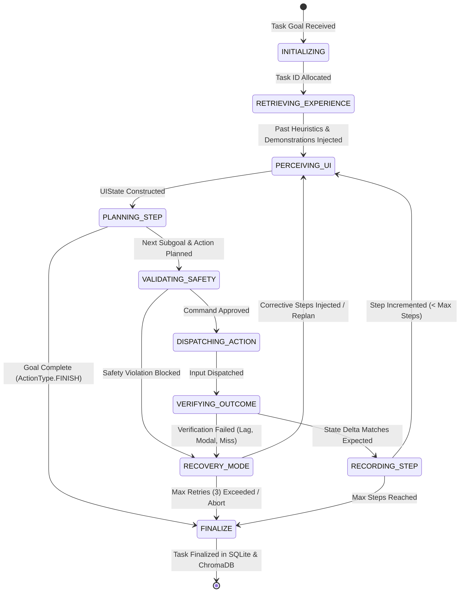

# Phase 6: LangGraph Agent State Machine (Closed-Loop Controller)

Phase 6 implements the **Central Closed-Loop State Machine** using **LangGraph**. It orchestrates the full perception-action-verification loop, links the hybrid perception engine, safety guardrails, action primitives, two-tier outcome verifier, and dual-layer memory into an autonomous agent runtime.

---

## Architecture & State Machine

---

## User Review Required

> [!IMPORTANT]
> - **LangGraph Execution Engine**: Uses `langgraph.graph.StateGraph` with a strongly-typed `AgentState` dictionary/model.
> - **Closed-Loop Safety Validation**: Every planned action is checked against `ActionSafetyGuard` *before* reaching `ActionExecutor`.
> - **Autonomous Recovery Routing**: Verification failures (e.g. `MODAL_BLOCKED`, `MISSED_CLICK`) route automatically through `RecoveryEngine` to inject corrective actions (e.g., dismiss modal with `ESC`) before replanning.
> - **Dry-Run & Mock Modes**: For environments without display servers or during automated CI tests, `SIVACAgent` supports dry-run execution and synthetic UIState inputs.

---

## Proposed Changes

### Core Agent Module (`src/vision_agent/agent/`)

#### [NEW] [state.py](file:///d:/CodeWIthMe/Vision-Agent/src/vision_agent/agent/state.py)
- `AgentState` schema for LangGraph (TypedDict & Pydantic compatible):
  - `task_id: str`
  - `goal: str`
  - `application: str`
  - `step_count: int`
  - `max_steps: int`
  - `current_ui_state: Optional[UIState]`
  - `previous_ui_state: Optional[UIState]`
  - `planned_subgoal: str`
  - `current_action: Optional[ActionCommand]`
  - `last_execution_result: Optional[ActionResult]`
  - `last_verification_result: Optional[VerificationResult]`
  - `recovery_plan: Optional[RecoveryPlan]`
  - `action_history: List[Dict[str, Any]]`
  - `execution_history: List[Dict[str, Any]]`
  - `verification_history: List[Dict[str, Any]]`
  - `retrieved_guidance: str`
  - `is_complete: bool`
  - `is_failed: bool`
  - `error_summary: str`
  - `retry_count: int`

#### [NEW] [planner.py](file:///d:/CodeWIthMe/Vision-Agent/src/vision_agent/agent/planner.py)
- `HierarchicalPlanner`:
  - Formulates LLM prompt with:
    1. Current high-level user goal.
    2. Active application and window title.
    3. Filtered interactive UI elements (`id`, `type`, `text`, `center`).
    4. Retrieved past experiences and application heuristics.
    5. Recent action and verification history.
  - Prompts reasoning LLM via `ModelFactory.get_reasoning_model()` with structured Pydantic parser.
  - Fallback heuristic planning for test environments or when offline.

#### [NEW] [nodes.py](file:///d:/CodeWIthMe/Vision-Agent/src/vision_agent/agent/nodes.py)
- LangGraph node implementations:
  - `initialize_node`: Allocates task session in SQLite.
  - `retrieve_node`: Queries `ExperienceRetriever` for past task few-shot demonstrations and application heuristics.
  - `perceive_node`: Captures screen and constructs unified `UIState` via `HybridPerceptionEngine`.
  - `plan_node`: Calls `HierarchicalPlanner` to produce subgoal and `ActionCommand`.
  - `safety_node`: Validates planned command with `ActionSafetyGuard`.
  - `act_node`: Dispatches approved command via `ActionExecutor`.
  - `verify_node`: Compares pre/post UIState with `OutcomeVerifier`.
  - `recover_node`: Injects corrective steps via `RecoveryEngine` or transitions to abort.
  - `record_node`: Persists step and verification into `EpisodicMemoryManager`.
  - `finalize_node`: Updates task completion status in SQLite and ChromaDB.

#### [NEW] [graph.py](file:///d:/CodeWIthMe/Vision-Agent/src/vision_agent/agent/graph.py)
- `build_agent_graph()`: Constructs the compiled `StateGraph` with conditional edge routing.
- `SIVACAgent`: High-level user-facing runner class with `run(goal, max_steps)` and `step()` streaming APIs.

#### [NEW] [__init__.py](file:///d:/CodeWIthMe/Vision-Agent/src/vision_agent/agent/__init__.py)
- Export `AgentState`, `HierarchicalPlanner`, `SIVACAgent`, and `build_agent_graph`.

#### [MODIFY] [src/vision_agent/__init__.py](file:///d:/CodeWIthMe/Vision-Agent/src/vision_agent/__init__.py)
- Expose `SIVACAgent` and `AgentState` at top-level.

---

### Verification & Testing

#### [NEW] [test_agent.py](file:///d:/CodeWIthMe/Vision-Agent/test_agent.py)
- Test Suite:
  1. `test_agent_state_initialization`: Verifies initial state contracts.
  2. `test_hierarchical_planner`: Verifies structured action generation with context injection.
  3. `test_safety_guard_routing`: Verifies unsafe commands are caught and routed to recovery.
  4. `test_closed_loop_agent_execution`: Full execution of a multi-step task terminating at `FINISH`.
  5. `test_recovery_closed_loop`: Injected modal failure triggering automated ESC dismissal and successful recovery.

---

## Verification Plan

### Automated Tests
- Run `.venv\Scripts\python test_agent.py`
- Validate that all 5 test suites pass with exit code 0.
- Verify regression on existing tests:
  - `.venv\Scripts\python test_actions.py`
  - `.venv\Scripts\python test_verifier.py`
  - `.venv\Scripts\python test_memory.py`
